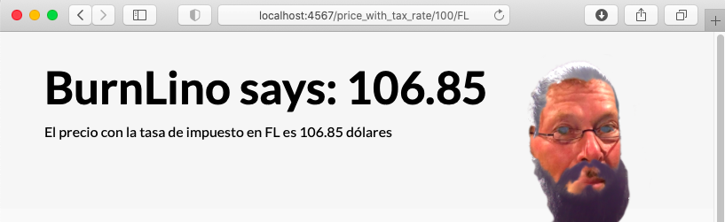

# Entre Puertos y Adaptadores: La Arquitectura Hexagonal.

[](https://twitter.com/totheralistair)
[](https://twitter.com/andras_io)


## BurnLino

Código fuente presentado en la charla dictada por [Alistair Cockburn](https://github.com/totheralistair) y [Andrés N. Robalino](https://github.com/andrasio). Se implementa el hexágono pedazo por pedazo hasta cumplir con todas las funciones (`PriceMaker`) que son:

1. Devolver el mismo valor entregado.
2. Devolver tasa de impuesto para algún estado del país Estados Unidos (El estado *Florida* sería ~6%)
3. Precio total tomando en cuenta la tasa de impuesto de un estado en particular.

Adicionalmente se incluyen adaptadores demostrando el intercambio de tecnologías y las ejecutadoras (*actores*) principales.

## Dependencias

Para poder ejecutar las pruebas se necesita JUnit y Hamcrest (maneras de descargarlo [aquí](https://github.com/junit-team/junit4/wiki/Download-and-Install)).

## Ejecución de la aplicación CLIApp.

Puedes hacerlo directamente desde el IDE o también compilar todas las clases. Asumiendo que `burnlino.jar` existe y se encuentra en `/Users/andrasio/Code/cobolin/burnlino.jar` podemos hacer:
```shell
java -cp .:/Users/andrasio/Code/cobolin/burnlino.jar com.andrab.flares.cobolino.Main echoValue 500
java -cp .:/Users/andrasio/Code/cobolin/burnlino.jar com.andrab.flares.cobolino.Main getTaxRateForState FL
java -cp .:/Users/andrasio/Code/cobolin/burnlino.jar com.andrab.flares.cobolino.Main calculatePriceWithTaxRate 50 FL
```

Este repositorio proporciona `burnlino.jar` para usarlo de esa manera. Si deseas experimentar con puertos e intercambiarlos, necesitas editar el código fuente y recompilar. Puedes realizar la generación de `burnlino.jar` usando uno de los scripts en la carpeta `bin` o `nu` también de la siguiente manera:

En [Nushell](https://www.nushell.sh)
```shell
nu nu/generate_jar.nu
```

Bash
```shell
./bin/generate_jar
```

También puedes ejecutar el script para ejecutar la aplicación (verifica que la fuente donde se encuentra `burnlino.jar` en el script es el mismo de tu máquina). Solamente está de conveniencia para ejecutar tres veces la aplicacíon y generando `burnlino.jar` previo a ese paso también.


En [Nushell](https://www.nushell.sh)
```shell
nu nu/cli_examples.nu
```

Bash
```shell
./bin/cli_examples
```

## Ejecución de la aplicación WebApp



Para poder arrancar la aplicación web, vas a necesitar instalar [JRuby 9.2.13.0](https://www.jruby.org/download). Una vez hecho eso, asegúrate de que se encuentre en el `PATH` los binarios de la carpeta `bin` de JRuby en la shell que usas de preferencia y que no hayan conflictos si se tienen otros ámbitos de desarrollo de Ruby ([rvm](https://rvm.io/interpreters/jruby) también es otra opción).

Verifica que se encuentra satisfactoriamente lo siguiente:

```
 Ⲗ > which gem
─────────┬───────────────────────────────────────────────────────
 arg     │ gem
 path    │ /Users/andrasio/code/cobolin/jruby-9.2.13.0/bin/gem
 builtin │ No
─────────┴───────────────────────────────────────────────────────
```

```
 Ⲗ > which jruby
─────────┬─────────────────────────────────────────────────────────
 arg     │ jruby
 path    │ /Users/andrasio/code/cobolin/jruby-9.2.13.0/bin/jruby
 builtin │ No
─────────┴─────────────────────────────────────────────────────────
```

Si logras ver algo similar (es decir, `gem` y `jruby` se encuentren dentro del directorio de JRuby que descargaste `jruby-9.2.13.0`), instala `bundler`:

```
gem install bundler
```

Ahora en la carpeta `web_app`, instala las dependencias así:

```
bundle install
```

Si todo sale bien y se instalan las dependencias, puedes instanciar la aplicación web (¡y no olvides que tiene que existir `burnlino.jar` también!) así: 

```./price_maker```